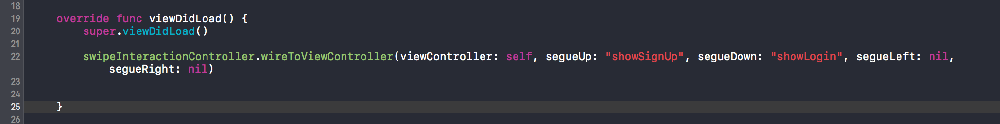

# Interactive-SwipeGesture-Segues-Swift
Interactive Swipe Gesture class that will recognize any user swipe and determine the proper segue to execute.

> This implementation assumes that you've already included transitioning delegates and animationController(forPresented/forDismissed) functions in your ViewController

##

